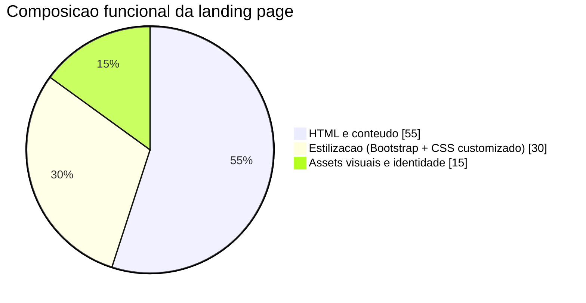
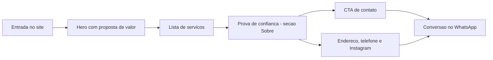
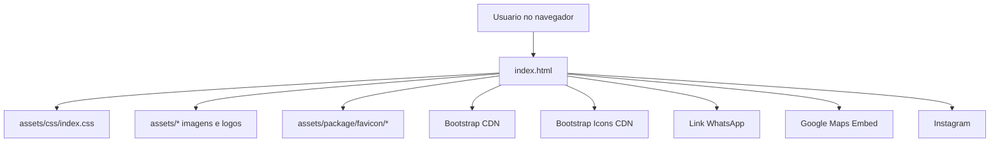

# UVfillms

Landing page institucional da UVfillms para apresentar servicos automotivos em Cuiaba - MT, com foco em conversao rapida via WhatsApp.

## 1. Visao geral

Este repositorio contem um front-end estatico (sem build) organizado para publicacao direta em hospedagem simples.

Objetivos do projeto:

- apresentar servicos e diferenciais da empresa de forma clara;
- facilitar o primeiro contato comercial no menor numero de cliques;
- fortalecer confianca com provas visuais, endereco e canais oficiais;
- manter manutencao simples, com baixo custo operacional.

## 2. Infografico do projeto

### 2.1 Resumo executivo

| Indicador               | Valor                                                    |
| ----------------------- | -------------------------------------------------------- |
| Tipo de aplicacao       | Landing page estatica (one-page)                         |
| Arquivo de entrada      | `index.html`                                             |
| Arquivos no repositorio | 25                                                       |
| CSS customizado         | `assets/css/index.css`                                   |
| JavaScript customizado  | Inline em `index.html` (ano dinamico no rodape)          |
| Framework UI            | Bootstrap 5.3.3 (CDN)                                    |
| Biblioteca de icones    | Bootstrap Icons 1.11.3 (CDN)                             |
| Secoes principais       | `inicio`, `servicos`, `sobre`, `localizacao` + bloco CTA |
| Conversao principal     | WhatsApp (`wa.me`)                                       |
| Integracoes externas    | WhatsApp, Instagram, Google Maps, jsDelivr               |

### 2.2 Composicao funcional



### 2.3 Jornada do usuario



## 3. Arquitetura do front-end

### 3.1 Estrutura em camadas

1. Conteudo e semantica (HTML)

- Estrutura principal em `index.html`.
- Navegacao com ancora para secoes (`#inicio`, `#servicos`, `#sobre`, `#localizacao`).
- Blocos de conteudo com componentes Bootstrap (navbar, grid, cards, botoes).

2. Apresentacao (CSS)

- Tema visual em `assets/css/index.css` com variaveis CSS no `:root`.
- Regras de marca (`--uv-dark`, `--uv-blue`, `--uv-cyan`, `--uv-purple`, `--uv-light`).
- Responsividade com breakpoints e ajustes para telas menores.

3. Comportamento e integracoes

- Bootstrap Bundle para colapso de menu mobile.
- Script simples para ano dinamico no rodape.
- Integracoes por links externos (WhatsApp, Instagram e Google Maps embed).

### 3.2 Diagrama de arquitetura



## 4. Inventario completo de arquivos

```text
uvfillmes/
├── README.md
├── index.html
└── assets/
		├── css/
		│   └── index.css
		├── fachada.jpeg
		├── logo-referencia.jpeg
		├── logo.png
		├── logo.svg
		├── logo_adobe_svg.svg
		└── package/
				├── business-card-svg/
				│   ├── README.txt
				│   ├── business-card-back-print.svg
				│   ├── business-card-back.svg
				│   ├── business-card-front-back.svg
				│   ├── business-card-front-print.svg
				│   └── business-card-front.svg
				└── favicon/
						├── README.txt
						├── apple-touch-icon.png
						├── favicon-16x16.png
						├── favicon-192x192.png
						├── favicon-32x32.png
						├── favicon-48x48.png
						├── favicon-512x512.png
						├── favicon-head.html
						├── favicon.ico
						├── favicon.svg
						└── site.webmanifest
```

## 5. Componentes e secoes da pagina

1. Navbar fixa

- Logo principal.
- Links para secoes internas.
- Botao de orcamento com CTA para WhatsApp.

2. Hero de abertura

- Proposta de valor principal.
- Destaques de confianca (instalacao, acabamento, experiencia).
- CTA primario e CTA secundario.

3. Secao de servicos

- Grade de cards com seis servicos:
- Pelicula termica.
- Eletrica automotiva.
- Iluminacao LED.
- Acessorios automotivos.
- Instalacao profissional.
- Orcamento rapido.

4. Secao sobre

- Imagem da fachada.
- Bloco de credibilidade com tempo de mercado.
- Quatro pilares de atendimento.

5. Bloco CTA intermediario

- Reforco de conversao via WhatsApp.

6. Secao de localizacao

- Endereco completo.
- Telefone/WhatsApp clicavel.
- Instagram oficial.
- Botao para rota e mapa incorporado.

7. Rodape

- Marca textual.
- Links sociais.
- Ano automatico.

8. Botao flutuante

- Atalho persistente para WhatsApp em telas desktop e mobile.

## 6. Identidade visual e design system base

### 6.1 Paleta declarada

- `--uv-dark`: `#090d2b`
- `--uv-blue`: `#2947a9`
- `--uv-cyan`: `#45b9e5`
- `--uv-purple`: `#bd4aa7`
- `--uv-light`: `#f7f9ff`

### 6.2 Recursos visuais incluidos

- Logos em SVG e PNG para uso digital.
- Pacote de favicons completo (inclusive manifesto web).
- Kit vetorial de cartao de visita (frente/verso e versoes para impressao).

## 7. Dependencias externas

Carregadas por CDN em `index.html`:

- Bootstrap `5.3.3` (CSS + JS bundle).
- Bootstrap Icons `1.11.3`.

Observacoes:

- sem gerenciador de pacotes no estado atual;
- sem pipeline de build/transpilacao;
- deploy orientado a arquivos estaticos.

## 8. Execucao local

Opcao 1: abrir `index.html` diretamente no navegador.

Opcao 2: subir servidor local estatico.

Exemplo com Python:

```bash
python3 -m http.server 5500
```

Acesso:

```text
http://localhost:5500
```

## 9. Dados de negocio mapeados no front-end

- Empresa: UVfillms.
- Cidade: Cuiaba - MT.
- Endereco: Av. Professora Alice Freire Silva, CPA II, Cuiaba - MT, 78055-534.
- Telefone/WhatsApp: (65) 99268-4345.
- Instagram: @uvfillms.
- Conversao principal: clique para WhatsApp com mensagem pre-preenchida.

## 10. Melhorias recomendadas

- mover scripts inline para `assets/js/` (melhor organizacao e cache);
- adicionar metricas de conversao (GA4 e/ou Meta Pixel);
- incluir metadados SEO local (Open Graph, Schema.org LocalBusiness);
- incluir validacao automatica de links e acessibilidade basica;
- criar checklist de publicacao para atualizar dados de contato sem risco.

---

Projeto orientado a presenca digital local, com arquitetura simples e manutencao direta para times pequenos.
