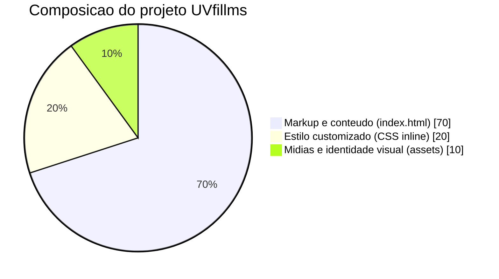
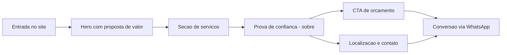

# UVfillms

Landing page institucional da UVfillms para divulgação de serviços automotivos em Cuiaba - MT, com foco em conversao via WhatsApp.

## 1. Sobre o projeto

O projeto foi desenvolvido como um site one-page para apresentar a empresa, seus servicos e seus canais de contato.

Principais objetivos:

- comunicar os servicos de forma clara e visual;
- facilitar o contato comercial imediato;
- reforcar confianca com localizacao, experiencia e identidade de marca;
- manter carregamento rapido e estrutura simples de manutencao.

## 2. Infografico de dados

### Resumo rapido

| Indicador              | Valor atual                                             |
| ---------------------- | ------------------------------------------------------- |
| Tipo de projeto        | Landing page estatica                                   |
| Arquivo principal      | 1 (`index.html`)                                        |
| Assets de marca/imagem | 5 arquivos                                              |
| Framework CSS          | Bootstrap 5.3.3 (CDN)                                   |
| Biblioteca de icones   | Bootstrap Icons 1.11.3                                  |
| Secoes principais      | 5 (`inicio`, `servicos`, `sobre`, `cta`, `localizacao`) |
| Canais de conversao    | WhatsApp, Telefone, Instagram, Google Maps              |
| Regiao atendida        | Cuiaba - MT                                             |

### Distribuicao de composicao do projeto



### Fluxo da experiencia do usuario



## 3. O que compoe o projeto

## Estrutura de arquivos

```text
uvfillms/
├── index.html
├── README.md
└── assets/
	├── fachada.jpeg
	├── logo.png
	├── logo.svg
	├── logo-referencia.jpeg
	└── logo_adobe_svg.svg
```

## Camadas da aplicacao

1. Estrutura e conteudo (HTML)

- Navegacao sticky com ancora para secoes.
- Hero principal com imagem de fundo e chamada de conversao.
- Blocos de servicos com cartoes.
- Secao sobre com prova de experiencia.
- Bloco de localizacao com dados de contato e mapa embed.

2. Estilizacao (CSS)

- Variaveis de cor da marca via `:root`.
- Classes utilitarias personalizadas para paleta UVfillms.
- Ajustes responsivos para mobile com media query.
- Efeitos de hover em cards e CTA visual.

3. Comportamento e integracoes

- Bootstrap JS para menu responsivo.
- Script simples para atualizar ano automaticamente no rodape.
- Links diretos para WhatsApp com mensagem pre-formatada.
- Embed do Google Maps com endereco da empresa.

## Identidade visual mapeada

Paleta principal utilizada no projeto:

- `--uv-dark`: `#090d2b`
- `--uv-blue`: `#2947a9`
- `--uv-cyan`: `#45b9e5`
- `--uv-purple`: `#bd4aa7`
- `--uv-light`: `#f7f9ff`

## Servicos destacados no site

- Pelicula termica
- Eletrica automotiva
- Iluminacao LED
- Acessorios automotivos
- Instalacao profissional
- Orcamento rapido via WhatsApp

## 4. Stack e dependencias

Dependencias carregadas via CDN:

- Bootstrap 5.3.3
- Bootstrap Icons 1.11.3

Sem processo de build no estado atual. O projeto funciona como pagina estatica.

## 5. Como executar localmente

Como o projeto e estatico, basta abrir o arquivo principal no navegador:

1. Abrir `index.html` diretamente.
2. Ou servir a pasta com um servidor local simples.

Exemplo com Python:

```bash
python3 -m http.server 5500
```

Depois, acessar:

```text
http://localhost:5500
```

## 6. Canais e informacoes de negocio no projeto

- Endereco: Av. Professora Alice Freire Silva, CPA II, Cuiaba - MT, 78055-534
- Telefone/WhatsApp: (65) 99268-4345
- Instagram: @uvfillms
- Rota: Google Maps integrado na secao de localizacao

## 7. Proximas evolucoes recomendadas

- separar CSS e JS em arquivos dedicados (`assets/css` e `assets/js`);
- adicionar metricas (Google Analytics/Meta Pixel) para medir conversao;
- criar versao com formulario de lead para campanha;
- otimizar SEO local com dados estruturados (Schema.org LocalBusiness);
- implementar pipeline simples de deploy (GitHub Pages, Vercel ou Netlify).

---

Projeto focado em presenca digital local e conversao rapida para atendimento comercial da UVfillms.
